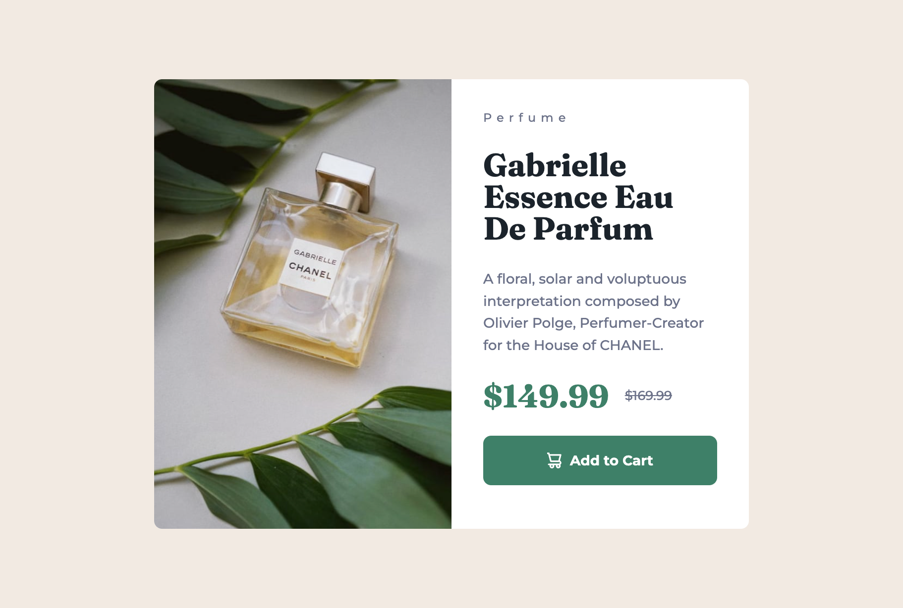

GOALS FOR CHALLENGE:
1. Use em and rem instead of px
2. Design Mobile-first
3. Work with branches for every iteration, getting it into my fingers. 
4. Use really semantic html, and give it some tought before I rush into writing it out. 
5. More structured and minimalistic code

# four-card-feature-section
